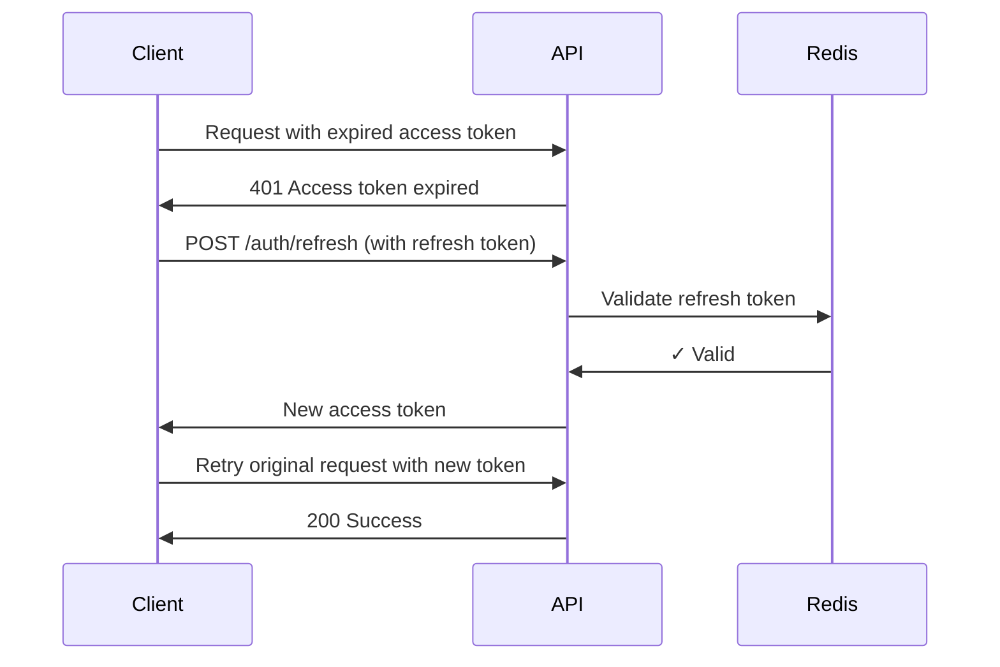

# 🔐 FastAPI Auth Service (JWT + Redis)

A lightweight authentication service built with **FastAPI**, **JWT access tokens**, and **Redis-backed refresh tokens**.

This service handles:
- 🔑 User registration & login
- 🔒 Secure password hashing (Argon2)
- ⚡ Short-lived JWT access tokens
- 🔄 Long-lived refresh tokens stored in Redis
- 🛡️ Protected routes using OAuth2 Bearer tokens

---

## 🚀 Tech Stack

| Technology | Purpose |
|-----------|---------|
| **FastAPI** | High-performance API framework |
| **PostgreSQL** | User & question data persistence |
| **Redis** | Refresh token storage & session management |
| **JWT (HS256)** | Stateless access tokens |
| **Argon2** | Password hashing algorithm |
| **Uvicorn** | Lightning-fast ASGI server |

---

## 📂 Project Structure

```text
.
├── app.py                # FastAPI entry point
├── auth_router.py        # /auth routes (login, register, refresh, logout)
├── jwt_auth.py           # JWT + refresh token utilities
├── user_auth.py          # Password hashing & user DB helpers
├── db.py                 # PostgreSQL connection pool + queries
├── redis_server/
│   └── client.py         # Redis client
├── .env                  # Environment variables (NOT committed)
└── README.md             # This file
```

---

## ⚙️ Environment Variables

Create a `.env` file in the project root:

```env
# PostgreSQL
DB_HOST=localhost
DB_PORT=5432
DB_NAME=your_db_name
DB_USER=your_db_user
DB_PASSWORD=your_db_password

# JWT
JWT_KEY=super-secret-key-change-this

# Redis
REDIS_URL=redis://localhost:6379
```

> ⚠️ **Never commit `.env` to GitHub**  
> Add `.env` to your `.gitignore` file

---

## 🧠 Authentication Overview

### Access Tokens
- 📄 **Format**: JSON Web Tokens (JWT)
- ⏱️ **Lifetime**: Short-lived (15 minutes)
- 📡 **Transport**: Sent via `Authorization: Bearer <token>`
- 💾 **Storage**: Stateless (not stored server-side)

### Refresh Tokens
- 🔐 **Format**: Cryptographically secure random strings
- ⏱️ **Lifetime**: Long-lived (14 days)
- 💾 **Storage**: Stored in Redis with automatic TTL expiration
- 🍪 **Transport**: Sent as HttpOnly cookies
- 🔄 **Purpose**: Issue new access tokens without re-authentication

---

## ▶️ Running the App

### 1️⃣ Start Redis

In one terminal:

```bash
redis-server
```

Verify Redis is running:

```bash
redis-cli ping
```

Expected response:

```text
PONG
```

### 2️⃣ Run FastAPI with Uvicorn

In another terminal (project root):

```bash
uvicorn app:app --reload
```

You should see:

```text
INFO:     Uvicorn running on http://127.0.0.1:8000 (Press CTRL+C to quit)
INFO:     Started reloader process [xxxxx] using StatReload
INFO:     Started server process [xxxxx]
INFO:     Waiting for application startup.
INFO:     Application startup complete.
```

### 3️⃣ Open Swagger UI

Navigate to:

```
http://127.0.0.1:8000/docs
```

From here you can:
- ✅ Register a user
- 🔓 Log in
- 🔑 Authorize using a Bearer token
- 🛡️ Call protected routes

---

## 🔑 Using Authorization: Bearer

After logging in, include the access token in request headers:

```http
Authorization: Bearer <access_token>
```

### Example Protected Endpoint

```python
from fastapi import Depends
from fastapi.security import OAuth2PasswordBearer
from jwt_auth import decode_access_token

oauth2_scheme = OAuth2PasswordBearer(tokenUrl="/auth/login")

@app.get("/questions/topics")
def get_topics(token: str = Depends(oauth2_scheme)):
    user_id = decode_access_token(token)
    return get_topics(user_id)
```

---

## 🔄 Token Refresh Flow



### How It Works:
1. ⏰ Access token expires
2. 🚫 API returns `401 Access token expired`
3. 🔄 Client calls `/auth/refresh`
4. ✅ New access token is issued
5. 🔁 Client retries original request

Refresh tokens are:
- 💾 Stored only in Redis
- ⏱️ Automatically expired after 14 days
- 🗑️ Invalidated on logout

---

## 🧪 Redis Debugging

### Check stored refresh tokens:

```bash
redis-cli
keys refresh:*
```

### Inspect a token:

```bash
get refresh:<refresh_token>
```

### Delete a token manually:

```bash
del refresh:<refresh_token>
```

### Monitor Redis activity:

```bash
redis-cli monitor
```

---

## 🔒 Security Notes

| Feature | Implementation |
|---------|---------------|
| 🔐 **Password Hashing** | Argon2 (memory-hard, resistant to GPU attacks) |
| 💉 **SQL Injection** | Parameterized queries throughout |
| 🍪 **Refresh Tokens** | HttpOnly cookies, server-side storage |
| ⏱️ **Access Tokens** | Short-lived (15 min) to limit exposure |
| 🔑 **Token Storage** | Redis with automatic expiration |

### Best Practices Implemented:
- ✅ Passwords are **never** stored in plaintext
- ✅ SQL queries are **parameterized** (SQL injection safe)
- ✅ Refresh tokens are **HttpOnly** and **server-side only**
- ✅ Access tokens are **short-lived** and **stateless**
- ✅ Secrets are **environment-based** (not hardcoded)

---

## 🛠️ Future Improvements

- [ ] 🚦 Rate limiting on auth endpoints
- [ ] 🔄 Token rotation for enhanced security
- [ ] 🎯 Scope-based authorization (role management)
- [ ] 🐳 Docker + docker-compose support
- [ ] ☁️ Deployment configuration (Railway / Fly / AWS)
- [ ] 📧 Email verification flow
- [ ] 🔐 2FA support
- [ ] 📊 Audit logging

---

## 🧠 TL;DR

**Quick Start:**

```bash
# Terminal 1: Start Redis
redis-server

# Terminal 2: Start FastAPI
uvicorn app:app --reload
```

Then open **http://127.0.0.1:8000/docs** and you're good to go! 🚀

---

## 📝 API Endpoints

| Method | Endpoint | Description | Auth Required |
|--------|----------|-------------|---------------|
| `POST` | `/auth/register` | Create new user account | ❌ |
| `POST` | `/auth/login` | Login and receive tokens | ❌ |
| `POST` | `/auth/refresh` | Get new access token | 🍪 Refresh token |
| `POST` | `/auth/logout` | Invalidate refresh token | 🍪 Refresh token |
| `GET` | `/questions/topics` | Get question topics | 🔑 Bearer token |

---

## 📄 License

This project is open source and available under the [MIT License](LICENSE).

---

## 🤝 Contributing

Contributions, issues, and feature requests are welcome!

1. Fork the repository
2. Create your feature branch (`git checkout -b feature/AmazingFeature`)
3. Commit your changes (`git commit -m 'Add some AmazingFeature'`)
4. Push to the branch (`git push origin feature/AmazingFeature`)
5. Open a Pull Request

---

## 📧 Support

If you have any questions or run into issues, please open an issue on GitHub.

---

**Built with ❤️ using FastAPI**
